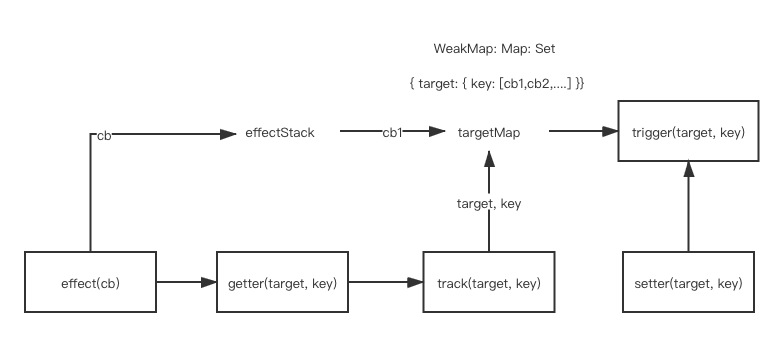

# Vue 响应式原理之源码分析

数据响应式是MVVM框架的一大特点，Vue2 中利用 Object.defineProperty() 通过定义对象属性的setter/getter拦截属性的访问，Vue3中则是利用Proxy()拦截的，两种不同的数据拦截方式，导致 Vue2 和 Vue3 中数据响应式的设计有所不同。下面我们依次分析源码中 Vue2 和 Vue3 的数据响应式是如何实现的。

## Vue2 中数据响应式原理分析

下面我们只针对 Vue2 源码中的数据响应式做分析，Vue的初始化流程不是本篇文章的主题。

Vue2 的数据响应式开始于 src/core/instance/state.js 中的 initData() 方法

``` js
function initData (vm: Component) {
  observe(data, true /* asRootData */)
}
```

data就是我们写在选项里的数据

我们顺着去找observe()函数的定义，位于 src/core/instance/observer/index.js

``` js
/**
 * Attempt to create an observer instance for a value,
 * returns the new observer if successfully observed,
 * or the existing observer if the value already has one.
 */
function observe (value: any, asRootData: ?boolean): Observer | void {
  
  let ob: Observer | void

  // 初始化时创建一个
  ob = new Observer(value)

  return ob
}
```

observe() 返回了一个 Observer 的实例，出现了一个新的东西 **Observer 类**，Observer 类是做什么的？

``` js
class Observer {
  value: any;
  dep: Dep;
  vmCount: number;

  constructor (value: any) {
    this.value = value
    this.dep = new Dep()
    this.vmCount = 0
    def(value, '__ob__', this)
   
    // object
    this.walk(value)
  }

  /**
   * Walk through all properties and convert them into
   * getter/setters. This method should only be called when
   * value type is Object.
   */
  walk (obj: Object) {
    const keys = Object.keys(obj)
    for (let i = 0; i < keys.length; i++) {
      defineReactive(obj, keys[i])
    }
  }
}
```

从上面的代码中我们可以看到 Observer 类接受一个 value，也就是我们要做响应式处理的data对象。内部又有一个dep属性，又出来了一个新的类 **Dep**, 先不用管 Dep 类是做什么，先看一下 new Observer() 时做了什么

1. 创建了一个Dep的实例复制给了dep属性
2. 通过def(value, '__ob__', this)，又把 Observer 实例 复制给data的__ob__属性

在 src/core/instance/observer/dep.js中 我们再看一下Dep类是做什么的？

``` js
class Dep {
  static target: ?Watcher;
  id: number;
  subs: Array<Watcher>;

  constructor () {
    this.id = uid++
    this.subs = []
  }

  addSub (sub: Watcher) {
    this.subs.push(sub)
  }

  removeSub (sub: Watcher) {
    remove(this.subs, sub)
  }

  depend () {
    if (Dep.target) {
      Dep.target.addDep(this)
    }
  }

  notify () {
    // stabilize the subscriber list first
    const subs = this.subs.slice()
    if (process.env.NODE_ENV !== 'production' && !config.async) {
      // subs aren't sorted in scheduler if not running async
      // we need to sort them now to make sure they fire in correct
      // order
      subs.sort((a, b) => a.id - b.id)
    }
    // 循环内部所有watcher实例
    for (let i = 0, l = subs.length; i < l; i++) {
      subs[i].update()
    }
  }
}
```

从上面的代码我们可以看出， Dep类中有个一个depend()方法是用来添加订阅，notify是用来发布订阅的，添加的是什么？发布的是什么？添加的肯定是组件的更新函数，发布的是通知更新， 什么时候添加订阅？什么时候发布订阅？更新函数具体是什么？这些后面都会讲。

再梳理一下调用observe做了什么？

1. 对于传进去的每个对象都获取一个Observer的实例，这个实例主要是做对象的响应式
2. 对于对象里的每个key都调用defineReactive(), 对对象里的每个属性做响应式

``` js
function defineReactive (
  obj: Object,
  key: string,
  val: any,
  customSetter?: ?Function,
  shallow?: boolean
) {
  // 和当前key一一对应
  const dep = new Dep()

  const property = Object.getOwnPropertyDescriptor(obj, key)
  if (property && property.configurable === false) {
    return
  }

  // cater for pre-defined getter/setters
  const getter = property && property.get
  const setter = property && property.set
  if ((!getter || setter) && arguments.length === 2) {
    val = obj[key]
  }

  // 递归遍历
  // 每一个对象就有一个Observer实例与之对应
  let childOb = !shallow && observe(val)
  Object.defineProperty(obj, key, {
    enumerable: true,
    configurable: true,
    get: function reactiveGetter () {
      const value = getter ? getter.call(obj) : val
      // 依赖收集
      if (Dep.target) {
        // 和当前组件对应watcher建立关系
        dep.depend()
        if (childOb) {
          // 子ob也要和当前组件watcher建立关系
          childOb.dep.depend()
          // 如果是数组，内部所有项都要响应式处理
          if (Array.isArray(value)) {
            dependArray(value)
          }
        }
      }
      return value
    },
    set: function reactiveSetter (newVal) {
      const value = getter ? getter.call(obj) : val
      /* eslint-disable no-self-compare */
      if (newVal === value || (newVal !== newVal && value !== value)) {
        return
      }
      /* eslint-enable no-self-compare */
      if (process.env.NODE_ENV !== 'production' && customSetter) {
        customSetter()
      }
      // #7981: for accessor properties without setter
      if (getter && !setter) return
      if (setter) {
        setter.call(obj, newVal)
      } else {
        val = newVal
      }
      childOb = !shallow && observe(newVal)
      dep.notify()
    }
  })
}
```
defineReactive()会对传进去每个key 生成一个Dep的实例，在Object.defineProperty的 get 函数中开始依赖收集，在set中通知变化。

依赖收集的是什么？

从上面的代码中可以看出如果 Dep.target 存在，就执行dep.depend()，可以看出收集的应该是 Dep.target。

Dep.target 又是什么？

在src/core/instance/lifecycle.js 中又一个mountComponent方法，此方法是用来挂载组件的

``` js
function mountComponent (
  vm: Component,
  el: ?Element,
  hydrating?: boolean
): Component {
  new Watcher(vm, updateComponent, noop, {
    before () {
      if (vm._isMounted && !vm._isDestroyed) {
        callHook(vm, 'beforeUpdate')
      }
    }
  }, true /* isRenderWatcher */)
}
```
Watcher中传了一个updateComponent的函数，updateComponent就是更新组件的方法，可以认为Watcher就是用来更新组件的。

``` js
class Watcher {
  constructor() {
    this.value = this.lazy
      ? undefined
      : this.get()
  }

  get () {
    pushTarget(this)
  }
}
```

pushTarget就是把 Watcher 实例赋值给 Dep.target，所以上面依赖收集的时候收集的就是 Watcher 实例

## 总结

Vue2 响应式涉及到三个类，Observer，Dep， Watcher

Observer：每一个对象都会生成一个 Observer 实例，Observer 中保存一个dep属性，用于对象级别的响应式处理

Dep：在 Object.defineProperty 的 get 中收集依赖，在set中发布订阅

Watcher：用来保存组件更新函数，也就是作为依赖被收集

## Vue3 数据响应式原理分析

Vue2 用的是 Object.defineProperty 对对象的属性拦截，Vue3 中用的 Proxy。

Vue2 中数据响应式的缺点是：

1. 数组的响应式需要额外实现
2. 新增或删除属性无法监听，需要使用Vue.set，Vue.delete
3. 不支持Map，Set，Class等数据结构

Vue3 中使用 Proxy() 很好的解决了上面的问题。

下面我们仿照Vue3的响应式原理，自己实现一个

第一步：实现数据的响应式

``` js
const isObject = v => typeof v === 'object'

function reactive(obj) {
  if (!isObject(obj)) {
    return obj
  }
  
  return new Proxy(obj, {
    get(target, key) {
      const res = Reflect.get(target, key)
      return isObject(res) ? reactive(res) : res
    },
    set(target, key, val) {
      const res = Reflect.set(target, key, val)
      return res
    },
    deleteProperty(target, key) {
      const res = Reflect.deleteProperty(target, key)
      return res
    }
  })
}
```

第二步：依赖收集

Vue3 中的依赖收集先通过一张图理解一下



+ effect(cb): 传入fn，返回的函数将是响应式的，内部代理的数据发生变化，它会再次执行
+ track(target, key): 建立响应式函数与其访问的目标（target）和键（key）之间的映射关系
+ trigger(arget, key): 根据track()建⽴的映射关系，找到对应响应式函数并执⾏它

下面我们用代码实现

``` js
// 保存依赖关系数据结构
const targetMap = new WeakMap()

// 建立副作用
function effect(fn) {
  const e = createReactiveEffect(fn)
  e()
  return e
}

function createReactiveEffect(fn) {
  const effect = function () {
    try {
      effectStack.push(fn)
      return fn()
    } finally {
      effectStack.pop()
    }
  }
  return effect
}

// 依赖收集：建立target,key和fn之间映射关系
function track(target, key){
  const effect = effectStack[effectStack.length - 1]
  if(effect) {
    let depMap = targetMap.get(target)
    if (!depMap) {
      depMap = new Map()
      targetMap.set(target, depMap)
    }

    let deps = depMap.get(key)
    if (!deps) {
      deps = new Set()
      deps.set(key, deps)
    }

    deps.add(effect)
  }
}

// 触发副作用：根据target,key获取相关fns，执行它们
function trigger(target, key){
  const depMap = targetMap.get(target)

  if (depMap) {
    const deps = depMap.get(key)

    if (deps) {
      deps.forEach(dep => dep())
    }
  }
}
```

track() 要在上面的 get() 中调用

``` js
get(target, key) {
  const res = Reflect.get(target, key)
  track(target, key)
  return isObject(res) ? reactive(res) : res
}
```

trigger() 要在 set 中调用

``` js
set(target, key, val) {
  const res = Reflect.set(target, key, val)
  trigger(target, key)
  return res
}
```

## 把上面的两步结合起来实现一个可运行的 Vue3 Demo


reactive.js

``` js
const isObject = v => typeof v === 'object'

function reactive(obj) {
  if (!isObject(obj)) {
    return obj
  }
  
  return new Proxy(obj, {
    // target是被代理的对象
    get(target, key) {
      const res = Reflect.get(target, key)
      track(target, key)
      return isObject(res) ? reactive(res) : res
    },
    set(target, key, val) {
      const res = Reflect.set(target, key, val)
      trigger(target, key)
      return res
    },
    deleteProperty(target, key) {
      const res = Reflect.deleteProperty(target, key)
      console.log('deleteproperty');
      trigger(target, key)
      return res
    }
  })
}

// 临时存储副作用函数
const effectStack = []

// 建立副作用
function effect(fn) {
  const e = createReactiveEffect(fn)
  e()
  return e
}

function createReactiveEffect(fn) {
  const effect = function () {
    try {
      effectStack.push(fn)
      return fn()
    } finally {
      effectStack.pop()
    }
  }
  return effect
}

// 保存依赖关系数据结构
const targetMap = new WeakMap()

// 依赖收集：建立target,key和fn之间映射关系
function track(target, key){
  const effect = effectStack[effectStack.length - 1]
  if(effect) {
    let depMap = targetMap.get(target)
    if (!depMap) {
      depMap = new Map()
      targetMap.set(target, depMap)
    }

    let deps = depMap.get(key)
    if (!deps) {
      deps = new Set()
      deps.set(key, deps)
    }

    deps.add(effect)
  }
}
// 触发副作用：根据target,key获取相关fns，执行它们
function trigger(target, key){
  const depMap = targetMap.get(target)

  if (depMap) {
    const deps = depMap.get(key)

    if (deps) {
      deps.forEach(dep => dep())
    }
  }
}
```


``` html
<div id="app">
  <h3>{{title}}</h3>
</div>

<script src="reactive.js"></script>

<script>
const Vue = {
    createApp(options) {
      // web dom平台
      const renderer = Vue.createRenderer({
        querySelector(sel) {
          return document.querySelector(sel)
        },
        insert(child, parent, anchor) {
          // 不传递anchor，等效于appendChild
          parent.insertBefore(child, anchor || null)
        }
      })
      return renderer.createApp(options)
    },
    createRenderer({querySelector, insert}) {
      // 返回渲染器
      return {
        createApp(options) {
          // 返回的对象就是app实例
          return {
            mount(selector) {
              const parent = querySelector(selector)

              if (!options.render) {
                options.render = this.compile(parent.innerHTML)
              }

              // 处理setup
              if (options.setup) {
                this.setupState = options.setup()
              }
              if (options.data) {
                this.data = options.data()
              }

              this.proxy = new Proxy(this, {
                get(target, key) {
                  // 如果setupState中存在key，则用它，否则才使用data中的key
                  if (key in target.setupState) {
                    return target.setupState[key]
                  } else {
                    return target.data[key]
                  }
                },
                set(target, key, val) {
                  if (key in target.setupState) {
                    target.setupState[key] = val
                  } else {
                    target.data[key] = val
                  }
                },
              })

              this.update = effect(() => {
                // 执行render，获取视图结构
                const el = options.render.call(this.proxy)
                parent.innerHTML = ''
                // parent.appendChild(el)
                insert(el, parent)
              })
            },
            compile(template) {
              // 编译：
              // template =》 ast =》 ast => generate render()
              // 传入template，返回render
              return function render() {
                const h3 = document.createElement('h3')
                h3.textContent = this.title
                return h3
              }
            }
          }
        }
      }
    }
  }
</script>

<script>
  const { createApp } = Vue
  const app = createApp({
    setup() {
      const state = reactive({
        title: 'vue3,hello!'
      })

      setTimeout(() => {
        state.title = 'hello'
      }, 2000);
      return state
    }
  })
  app.mount('#app')
</script>
```

## 总结

Vue3 中用 Proxy() 做响应式数据后，功能更强大，依赖的收集和发布更容易理解。


 


